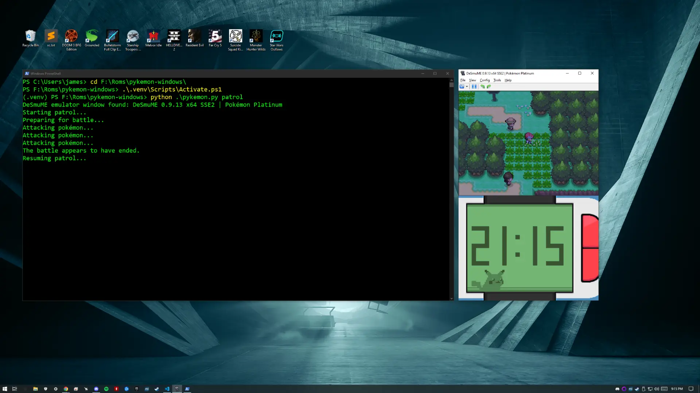
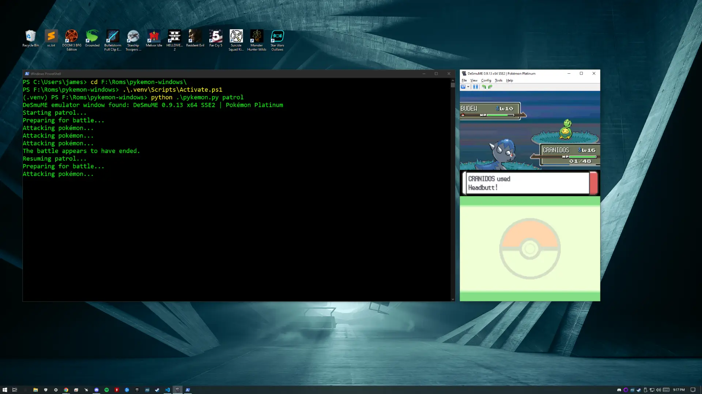
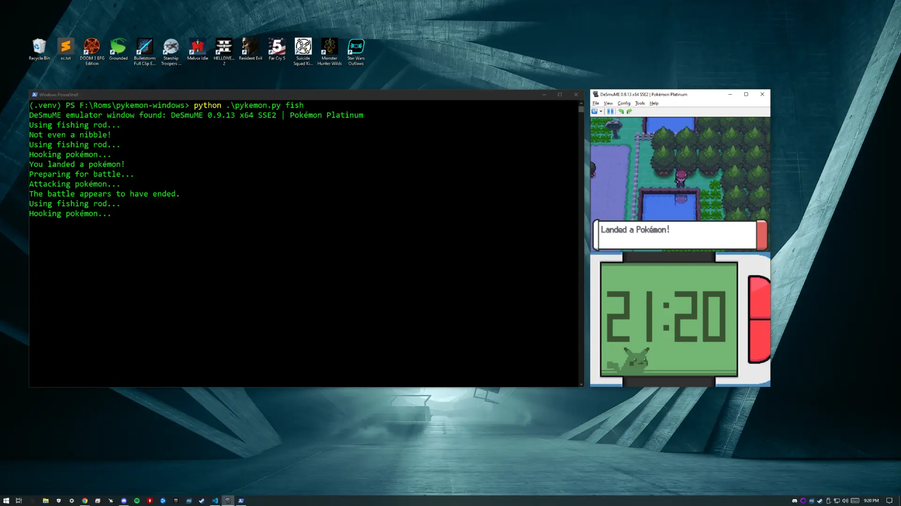
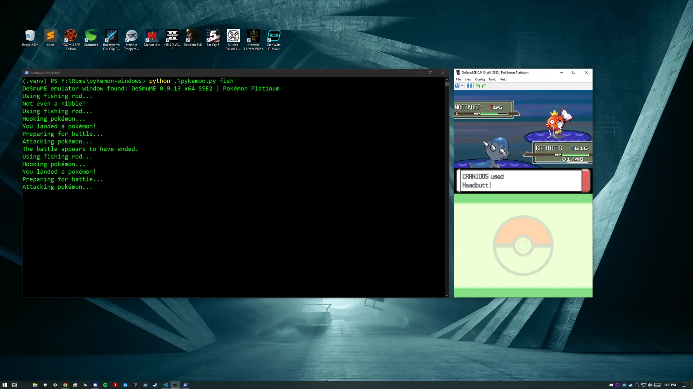

# Pykémon (Windows)

A Python script that automates boring tasks like battling pokémon, catching pokémon, and fishing. For now it only works with [Pokémon Platinum](https://www.nintendolife.com/games/ds/pokemon_platinum) using the [DeSmuME](https://desmume.org/) emulator for Windows.

I don't know why I made this. It took me longer to make than it would to play the game myself. Anyway, enjoy!

## Images

Here are some images of the script in action. Wow!

### Patrolling 🚶

Here you can see the character auto-patrolling high grass in search of pokémon.



### Battling ⚔️

Here you can see the character auto-battling a pokémon. If the pokémon hasn't already been caught the character will automatically throw pokéballs.



### Fishing 🎣

Here you can see the character auto-fishing. This is the most boring activity but it is great for farming Magikarp to level up low-level pokémon.



This Magikarp will make a fine Gyarados one day.



## Commands

### Activate the virtual environment:

```
.\.venv\Scripts\activate.bat
```

### Start Patrolling:

This command will have the character patrol a small area, left and right, in search of pokémon. Once a pokémon is found the character will either catch it or defeat it. After each battle the character will resume the patrol.

```
python .\pykemon.py patrol
```

### Start Fishing:

This command will have the character start fishing. Once a pokémon is hooked the character will either catch it or defeat it. After each battle the character will resume fishing.

```
python .\pykemon.py fish
```

### Start/Continue Battle:

This command is useful if you have already started battling a pokémon and you want the script to take over.

```
python .\pykemon.py battle
```

### Reset Keys:

This command is useful if you exit the script while a key is being pressed and it get "stuck".

```
python .\pykemon.py reset
```

## Useful Cheats

The following cheats can be added to DeSmuME as "Action Replay" cleats. Credit goes to [PokemonCoders](https://www.pokemoncoders.com/pokemon-platinum-cheats/) for these cheats. More cheats can be found on their website.

### Infinite PP

```
52240FB4 DBEF42AE
62101D40 00000000
B2101D40 00000000
000475E4 FFFFFFFF
00047764 FFFFFFFF
D2000000 00000000
```

### Infinite HP

```
52240FB4 DBEF42AE
62101D40 00000000
B2101D40 00000000
10047604 000003E7
10047608 000003E7
10047784 000003E7
10047788 000003E7
D2000000 00000000
```

### 100% Catch Rate

```
9224A948 00002801
1224A948 00004280
D2000000 00000000
```

## Helpful Links

* [Tesseract](https://github.com/UB-Mannheim/tesseract/wiki)
